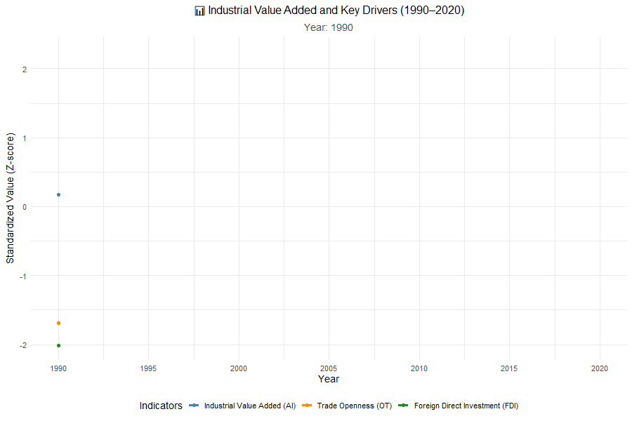

# 📊 Econometric Analysis: Trade, FDI, Growth, and Industrial Value Added

**Author:** Wesal Megahed  
**Date:** 2025-09-14  

This repository contains an RMarkdown analysis of the relationship between trade openness (OT), foreign direct investment (FDI), per capita GDP (PGDP), savings (S), globalization (GL), and industrial value added (AI).  

## Objectives
- Simulate economic indicators (1990–2020).
- Run correlation, unit root, and regression analysis.
- Perform cointegration tests (Johansen).
- Check diagnostics & robustness.
- Visualize results (plots, heatmaps, animated GIF).

## Files
- `econometric_analysis.Rmd` → main analysis code.
- `econometric_analysis.md` → GitHub-friendly rendered version.
- `growth.gif` → animated time-series plot.

### Scatterplot Matrix

### Time-Series Trends

### Animated Growth

