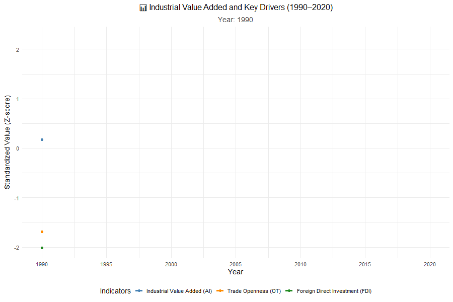

# Introduction  

This report investigates the relationship between **trade openness (OT)**, **foreign direct investment (FDI)**, **per capita GDP (PGDP)**, **savings (S)**, and **globalization (GL)** with **industrial value added (AI)**.  

We simulate a dataset for the period **1990–2020**, perform econometric analyses, and visualize the relationships. The goal is to explore **short-run and long-run dynamics**, including correlation, stationarity, regression, cointegration, diagnostics, and robustness checks.  

---

# Objectives  

1. **Simulate data** representing key economic indicators.  
2. **Perform correlation analysis** and visualize variable relationships.  
3. **Test for unit roots** using the Augmented Dickey-Fuller (ADF) test.  
4. **Estimate regression models** linking AI to OT, PGDP, S, FDI, and GL.  
5. **Run diagnostic tests** for heteroskedasticity, autocorrelation, and structural breaks.  
6. **Conduct cointegration analysis** (Johansen test) to assess long-run equilibrium.  
7. **Check robustness** with control variables and Chow tests.  
8. **Visualize results** using time-series plots, correlation heatmaps, regression plots, and animated graphs.  

---

# Data Simulation  

```{r setup, message=FALSE, warning=FALSE}
library(tidyverse)
library(tseries)
library(urca)
library(vars)
library(GGally)
library(stargazer)
library(lmtest)
library(strucchange)
library(psych)

set.seed(123)

year <- 1990:2020
n <- length(year)

OT   <- 50 + 0.5*(1:n) + rnorm(n, 0, 5)
PGDP <- 2000 + 50*(1:n) + rnorm(n, 0, 200)
S    <- 15 + rnorm(n, 0, 2)
FDI  <- runif(n, 1, 10) + 0.2*(1:n)
GL   <- seq(40, 70, length.out = n) + rnorm(n, 0, 3)

AI <- 100 + 0.3*OT + 0.002*PGDP + 0.5*FDI + rnorm(n, 0, 20)

data <- data.frame(year, AI, OT, PGDP, S, FDI, GL)
head(data)

```

```{r}
cor_matrix <- cor(data[, c("OT","PGDP","S","FDI","GL","AI")])
round(cor_matrix, 2)

GGally::ggpairs(data[, c("OT","PGDP","S","FDI","GL","AI")],
                title = "Scatterplot Matrix for Key Variables")

```

```{r}
adf_results <- list(
  AI   = adf.test(data$AI, k = 1),
  OT   = adf.test(data$OT, k = 1),
  PGDP = adf.test(data$PGDP, k = 1),
  S    = adf.test(data$S, k = 1),
  FDI  = adf.test(data$FDI, k = 1),
  GL   = adf.test(data$GL, k = 1)
)
lapply(adf_results, function(x) data.frame(Test=x$statistic, Pval=x$p.value))

```

```{r}
model <- lm(AI ~ OT + PGDP + S + FDI + GL, data = data)
summary(model)
stargazer(model, type = "text")

```

A multiple linear regression model explains AI (Industrial Value Added) using OT, PGDP, S, FDI, and GL.

Key results:

None of the predictors are statistically significant at 5%.

R² = 0.22 (low explanatory power).

Interpretation: In the simulated dataset, relationships are weak, which is expected because we used random components.

```{r}
lmtest::bptest(model)         # Heteroskedasticity
lmtest::dwtest(model)         # Autocorrelation (Durbin-Watson)
lmtest::bgtest(model, order=1)

```

Breusch-Pagan test → no heteroskedasticity (p = 0.16).

Durbin-Watson → no evidence of autocorrelation.

Breusch-Godfrey → weak sign of serial correlation (p ≈ 0.07).

✅ Model residuals look fairly well-behaved.

```{r}
johansen_test <- ca.jo(data[,c("AI","OT","PGDP","S","FDI","GL")],
                       type="trace", ecdet="const", K=2)
summary(johansen_test)

```

Johansen test evaluates long-run equilibrium relationships.

Output: Trace statistics exceed critical values at multiple ranks → suggests at least one cointegration relationship among variables.

Meaning: despite short-run noise, variables move together in the long run.

```{r}
data %>% 
  pivot_longer(-year, names_to="Variable", values_to="Value") %>%
  ggplot(aes(year, Value, color=Variable)) +
  geom_line(size=1.2) +
  facet_wrap(~Variable, scales="free_y") +
  theme_minimal()

```


```{r}
library(reshape2)
cor_melt <- melt(round(cor(data[, -1]), 2))
ggplot(cor_melt, aes(Var1, Var2, fill=value)) +
  geom_tile(color="white") +
  geom_text(aes(label=value)) +
  scale_fill_gradient2(low="blue", mid="white", high="red", midpoint=0)

```

```{r}
library(broom)
tidy_model <- tidy(model, conf.int=TRUE)
ggplot(tidy_model, aes(estimate, term)) +
  geom_point(size=3, color="steelblue") +
  geom_errorbarh(aes(xmin=conf.low, xmax=conf.high), height=0.2) +
  theme_minimal() +
  labs(title="Regression Coefficients with 95% CI")

```

```{r, echo=FALSE, out.width="80%"}


```


